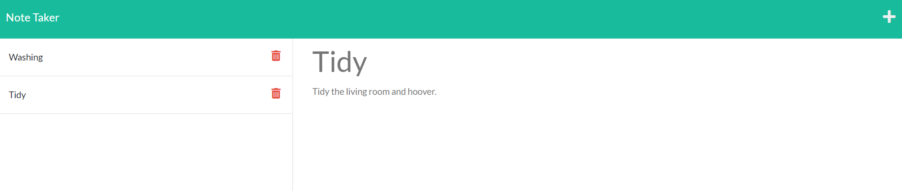

# Note_Taker

  [Project Repo](https://github.com/Cleggatron/Note_Taker)
  
  [Deployed Website](https://vast-everglades-18367.herokuapp.com/)
  
  

  ## Description

  This project allows a user to write/delete todo notes in a web front-end, These will be saved to the back end and then the fronted will be dynamically updated to display the notes that have been saved. It was a useful exercise to dip my toe into the world of routing https requests using express.

  ## Table Of Contents

  - [Installation](#installation)
  - [Usage](#usage)
  - [Credits](#credits)
  - [License](#license)
  - [Questions](#questions)

  ## Installation

  Once the repo has been cloned, open up the file location in the terminal and run the command `npm i`. This will install our dependancies. Then the file can either be hosted locally or pushed to service like Heroku to be hosted on the web.

  ## Usage

  

  Once all the dependancies are installed we can initalise it locally using the command `node server.js` or we can host it on Heroku. The we can access the front end. Go to the notes section, type in a note and clickthe save icon. This will create the note and save it to the back end.

  ## Credits

  Other Contributors: 
  N/A

  Third Party Technologies:
  The Third Party Code used:
 - express.js
 -  uuid

  ## License
  MIT License

  [License Link](https://opensource.org/licenses/MIT)

  Copyright <2021> <David Clegg>

      Permission is hereby granted, free of charge, to any person obtaining a copy of this software and associated documentation files (the "Software"), to deal in the Software without restriction, including without limitation the rights to use, copy, modify, merge, publish, distribute, sublicense, and/or sell copies of the Software, and to permit persons to whom the Software is furnished to do so, subject to the following conditions:
      
      The above copyright notice and this permission notice shall be included in all copies or substantial portions of the Software.
      
      THE SOFTWARE IS PROVIDED "AS IS", WITHOUT WARRANTY OF ANY KIND, EXPRESS OR IMPLIED, INCLUDING BUT NOT LIMITED TO THE WARRANTIES OF MERCHANTABILITY, FITNESS FOR A PARTICULAR PURPOSE AND NONINFRINGEMENT. IN NO EVENT SHALL THE AUTHORS OR COPYRIGHT HOLDERS BE LIABLE FOR ANY CLAIM, DAMAGES OR OTHER LIABILITY, WHETHER IN AN ACTION OF CONTRACT, TORT OR OTHERWISE, ARISING FROM, OUT OF OR IN CONNECTION WITH THE SOFTWARE OR THE USE OR OTHER DEALINGS IN THE SOFTWARE.  

  ## Questions

  If you have any questions you can contact me at the below email address:
  david.robert.clegg@gmail.com

  You can also find me at my Github:
  [Github Profile](https://github.com/Cleggatron)

